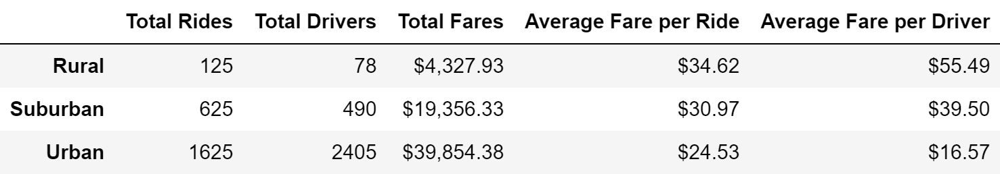

# PyBer-Analysis

## Overview
The purpose of this analysis was to understand the distribution of fare, ride, and driver data over different city types. We also explored how the total fares across these city types changed, on a weekly basis, over the course of several months. The purpose of summarizing the data as such was to understand how different variables affect the total fares in order to inform decision making at PyBer.

## Results
As we can see, from the data below, the largest source of revenue for PyBer is urban cities which account for more than the majority of total fares. Additionally, urban cities have a many more drivers than rides, while the opposite is true of suburban and rural cities.

When we consider total fares for each week across each city type, we see again how urban cities consistently dominate suburban and rural cities in terms of revenue. However, rural cities have the higest average fares per ride and per driver. 

## Summary
In light of our analysis we believe there are 3 ways to address the disparities in fares between the different types of cities:

1. Increase the number of rural and suburban drivers:
2. Decrease the number of drivers in urban cities:
3. Increase the number of rides in urban cities:
